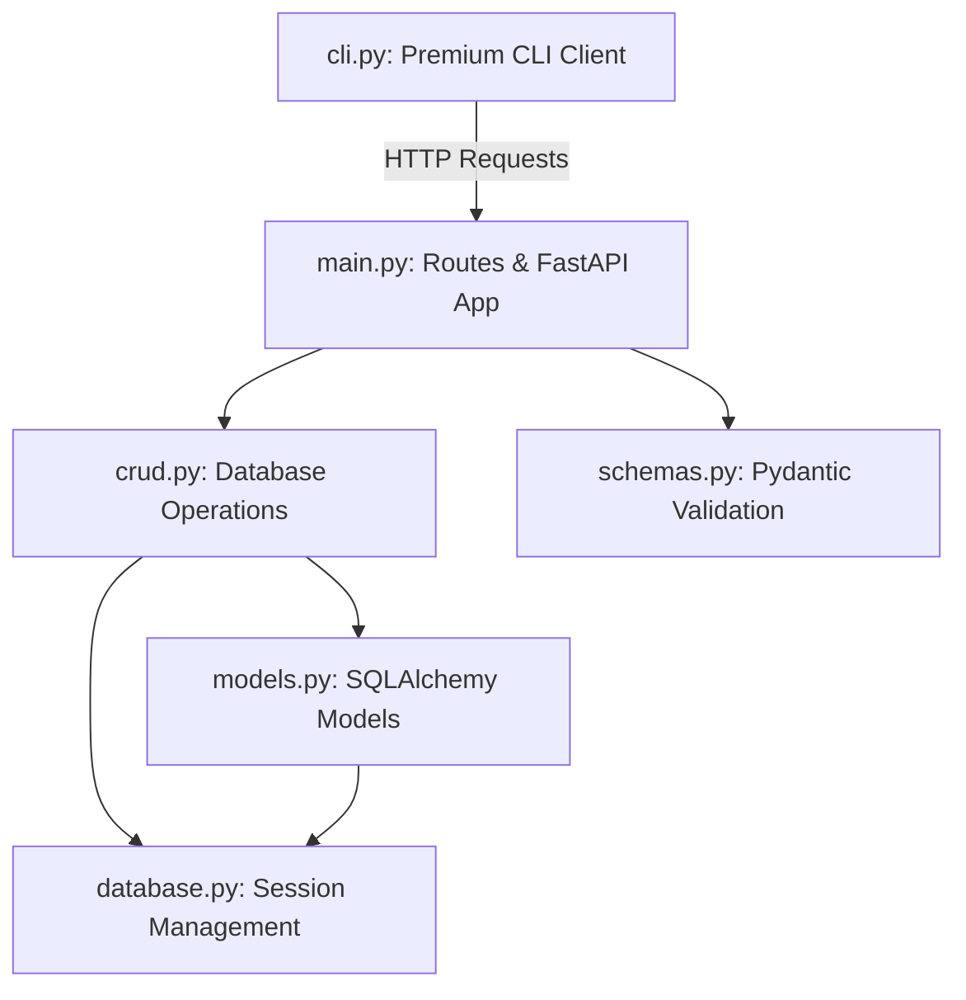

# Walkthrough - FastAPI Tasks & Lists CRUD Server & CLI

**Gemini-erstellt, der Vollständigkeit halber dokumentiert:**

We have successfully designed, built, and thoroughly tested a state-of-the-art CRUD server with **FastAPI**, **SQLAlchemy**, and **SQLite** along with a premium command-line interface (**CLI**) covering all features.

---

## Architecture Overview



---

## 1. The Command Line Interface (`cli.py`)

A fully-featured executable python CLI has been created in **[cli.py](file:///home/leonard/Dropbox/25_Studium/26SS/Frameworks%20f%C3%BCr%20Python/%C3%9Cbung/cli.py)**. It uses a custom-tailored visual formatting engine to print responses in beautiful ASCII tables.

### CLI Command Options

#### Task Commands
*   **List Tasks**:
    ```bash
    ./cli.py tasks list [--status open|closed] [--list-id <id>]
    ```
*   **Get Specific Task**:
    ```bash
    ./cli.py tasks get <id>
    ```
*   **Create Task**:
    ```bash
    ./cli.py tasks create "Task Title" [--desc "Description"] [--status open|closed] [--list-id <id>]
    ```
*   **Update Task**:
    ```bash
    ./cli.py tasks update <id> [--title "New Title"] [--desc "New Desc"] [--status open|closed] [--list-id <id>]
    ```
*   **Delete Task**:
    ```bash
    ./cli.py tasks delete <id>
    ```
*   **Link Tasks (Symmetric)**:
    ```bash
    ./cli.py tasks link <id> <other_id>
    ```
*   **Unlink Tasks (Symmetric)**:
    ```bash
    ./cli.py tasks unlink <id> <other_id>
    ```
*   **Assign Task to List**:
    ```bash
    ./cli.py tasks assign <id> <list_id>
    ```
*   **Unassign Task from List**:
    ```bash
    ./cli.py tasks unassign <id>
    ```

#### List Commands
*   **List Lists**:
    ```bash
    ./cli.py lists list
    ```
*   **Get Specific List**:
    ```bash
    ./cli.py lists get <id>
    ```
*   **Create List**:
    ```bash
    ./cli.py lists create "List Name" [--desc "Description"]
    ```
*   **Update List**:
    ```bash
    ./cli.py lists update <id> [--name "New Name"] [--desc "New Desc"]
    ```
*   **Delete List**:
    ```bash
    ./cli.py lists delete <id>
    ```

---

## 2. API Endpoint Layout

| Method | Endpoint | CLI Command Translation | Description |
| :--- | :--- | :--- | :--- |
| **GET** | `/tasks` | `tasks list` | Retrieve tasks with optional filtering. |
| **GET** | `/tasks/{id}` | `tasks get {id}` | Retrieve detailed task along with links. |
| **POST** | `/tasks` | `tasks create` | Create a new task. |
| **PUT** | `/tasks/{id}` | `tasks update` | Edit an existing task's fields. |
| **DELETE** | `/tasks/{id}` | `tasks delete` | Delete task & cascade unlink records. |
| **GET** | `/lists` | `lists list` | Retrieve all lists. |
| **GET** | `/lists/{id}` | `lists get {id}` | Get specific list with nested task counts. |
| **POST** | `/lists` | `lists create` | Create a new list. |
| **PUT** | `/lists/{id}` | `lists update` | Update list name or description. |
| **DELETE** | `/lists/{id}` | `lists delete` | Delete list. Preserves related tasks. |
| **POST** | `/tasks/{id}/link/{other_id}` | `tasks link` | Symmetrically links two tasks. |
| **POST** | `/tasks/{id}/unlink/{other_id}` | `tasks unlink` | Symmetrically unlinks two tasks. |
| **POST** | `/tasks/{id}/assign/{list_id}` | `tasks assign` | Assigns task to list. |
| **POST** | `/tasks/{id}/unassign` | `tasks unassign` | Sets a task's list_id to NULL. |

---

## 3. Comprehensive Testing Suite

We implemented an extensive automated test suite covering both the core FastAPI endpoints in **[test_main.py](file:///home/leonard/Dropbox/25_Studium/26SS/Frameworks%20f%C3%BCr%20Python/%C3%9Cbung/tests/test_main.py)** and the CLI command-routing handlers in **[test_cli.py](file:///home/leonard/Dropbox/25_Studium/26SS/Frameworks%20f%C3%BCr%20Python/%C3%9Cbung/tests/test_cli.py)**.

### Running the Test Suite

```bash
python3 -m pytest
```

### Execution Output

```text
============================= test session starts ==============================
platform linux -- Python 3.12.3, pytest-9.0.3, pluggy-1.6.0
rootdir: /home/leonard/Dropbox/25_Studium/26SS/Frameworks für Python/Übung
configfile: pyproject.toml
plugins: anyio-4.13.0
collecting ... collected 26 items                                                             

tests/test_cli.py ........                                               [ 30%]
tests/test_main.py ..................                                    [100%]

============================== 26 passed in 1.82s ==============================
```

All 26 tests passed flawlessly!
